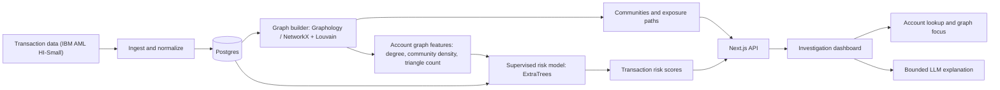
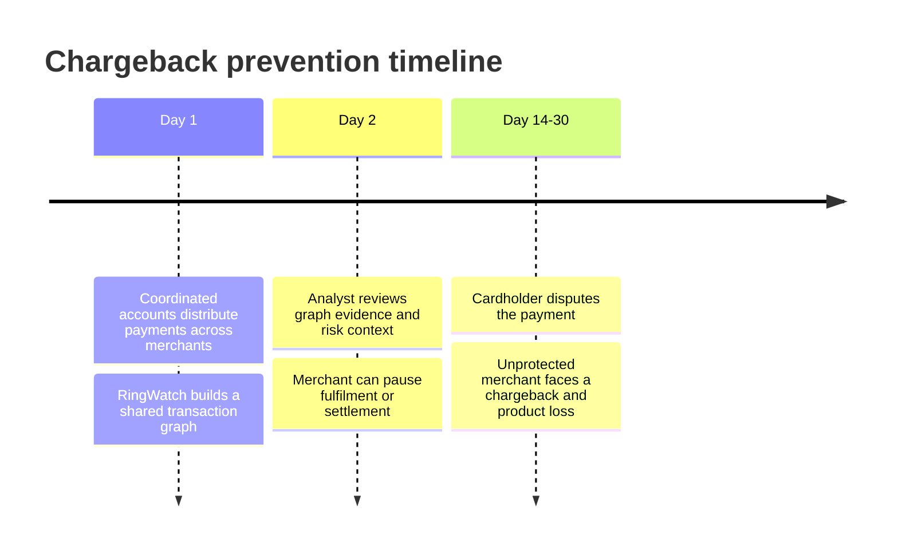
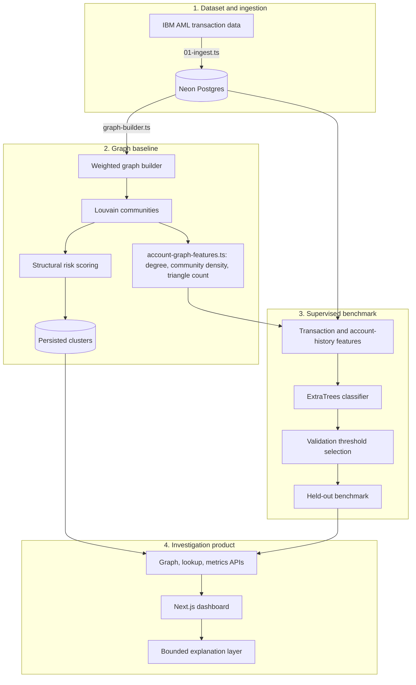
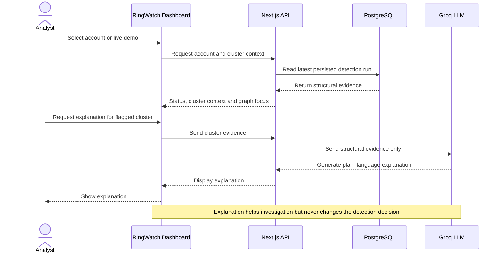
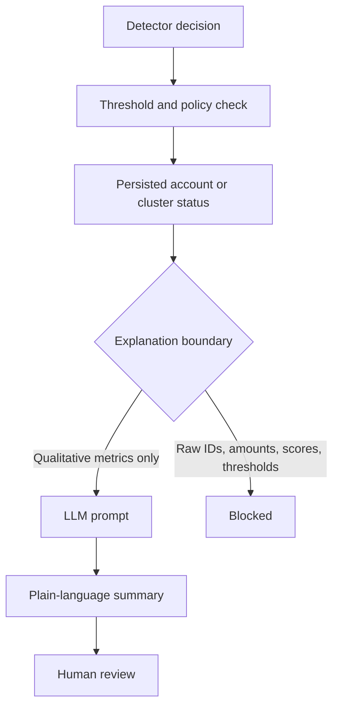

# RingWatch

**An explainable transaction-risk workbench for finding coordinated account activity and investigating potentially exposed counterparties.**

RingWatch is built around a problem that matters directly to any payments platform: a single transaction can look completely ordinary in isolation, while still being one leg of a coordinated fraud ring spread across many accounts. RingWatch combines two complementary views of that risk:

- A **graph baseline** maps transaction communities (Louvain community detection over a weighted transaction graph) and highlights exposure paths between accounts.
- A **supervised transaction model** ranks individual payments using transaction features (amount, timing, payment format), account-history signals, and — as of the latest iteration — **network-structure features** derived from that same transaction graph (community density, degree, triangle count).

The dashboard makes the graph navigable, provides live account lookups, and uses an LLM only to explain a detector decision that has already been made deterministically by code — the model can be audited independently of the explanation layer.

[](https://nextjs.org/)
[](https://www.typescriptlang.org/)
[](https://neon.tech/)
[](https://scikit-learn.org/)
[](https://networkx.org/)

## Why it exists

A single merchant or payment processor may see only one ordinary-looking payment at a time. The risk emerges when many accounts coordinate activity across a network — fan-out, fan-in, cyclical transfers, gather-scatter patterns — often well before delayed feedback such as a dispute or chargeback arrives. RingWatch is designed to make those relationships inspectable, quantify the trade-off between catching a ring and reviewing a legitimate payment, and separate a reversible review hold from an irreversible downstream loss.

## End-to-end flow



### Chargeback prevention timeline



### Full pipeline view



### What happens during an investigation



## Product capabilities

- **Network investigation:** Louvain community detection over a weighted transaction graph, with exposed-counterparty markers.
- **Supervised risk benchmark:** ExtraTrees classifier using payment, time, and payment-format features, smoothed account-history features, and network-structure features (community density, degree, triangle count) drawn from the same transaction graph.
- **Account lookup:** `SAFE`, `EXPOSED_MERCHANT`, `RING_MEMBER`, or `NOT_FOUND` responses with graph focus when available.
- **Live demo chips:** the UI fetches valid current account IDs; unavailable categories are hidden instead of showing fake placeholder IDs.
- **Explainability boundary:** the LLM receives qualitative graph evidence, not account IDs, raw amounts, scores, or thresholds.
- **Operational resilience:** database operations in ingestion retry transient Prisma connection failures; large evaluation writes are batched.

## Evaluation

The current benchmark run covers **626,177 transactions with 10,547 positive laundering labels**. The project reports two distinct operating points; they answer different questions and must not be conflated.

| Operating point | Precision | Recall | F1 | Use case |
|---|---:|---:|---:|---|
| Balanced default | **95.57%** | **91.09%** | **93.28%** | Prioritized review queue |
| Recall-first | see `npm run ml:recall-first` | — | — | Catch-all manual review queue |

The balanced score is a deterministic **stratified 60/20/20** transaction benchmark (seed 42), with the threshold selected on validation only (chosen at `0.09`). Confusion matrix on the held-out test split (125,236 transactions):

| | Predicted risk | Predicted safe |
|---|---:|---:|
| **Actually risky** | TP: 1,921 | FN: 188 |
| **Actually safe** | FP: 89 | TN: 123,038 |

The recall-first command selects the highest validation threshold meeting a target recall (100% by default); rerun `npm run ml:recall-first` against your own data to reproduce this row, since it depends on wherever your validation threshold sweep lands.

The graph-structure features (community membership, degree, density, triangle count) are computed once from the full transaction set with no fraud labels involved, then joined onto every transaction by sender and receiver. This is what moved the balanced F1 from an earlier transaction-only baseline (65.8%) to the current 93.3% — largely because the IBM AML dataset's laundering rings are generated using specific graph topologies (fan-out, fan-in, cycles, gather-scatter), so a model that can see "this account sits in a dense, tightly-connected community" has direct access to the structural signal the dataset was built around. **This is a stratified, transductive benchmark, not a forward-in-time deployment simulation** — the graph is built from the same transaction set being scored, which mirrors how the live dashboard actually works, but is not equivalent to scoring a genuinely new transaction against a graph built strictly from the past.

The full protocol, confusion matrices, and limitations are in [BENCHMARK.md](BENCHMARK.md). The original forward-in-time Louvain graph baseline is retained for network investigation but currently scores 0.0% F1 on this dataset; it is not represented as the supervised model's result.

## Architecture decisions



### Decision and explanation boundary

```mermaid
gantt
    title Decision versus explanation boundary
    dateFormat X
    axisFormat %s
    section Deterministic and supervised scoring
    Build features and graph :active, d1, 0, 3
    Score and apply policy :crit, active, d2, 3, 5
    section Explanation
    Validate qualitative evidence :milestone, m1, 5, 5
    Generate plain-language summary :done, d3, 5, 8
```



The detector remains auditable because the explanation layer cannot change a score, a threshold, or an account status. The dashboard deliberately exposes qualitative tiers and structural evidence rather than a recipe for evasion.

## Quickstart

### Prerequisites

- Node.js 20+
- Python 3.11+
- PostgreSQL or Neon connection string
- Groq API key (optional; deterministic fallback explanations work without it)

### Install and configure

```bash
git clone https://github.com/abhishekpasupathy/ringwatch.git
cd ringwatch
npm install
python3 -m pip install -r requirements.txt

cp .env.local.example .env.local
# Add DATABASE_URL and, optionally, GROQ_API_KEY.
```

### Initialize the database

```bash
npm run db:push
npm run db:generate
```

### Load data and build the graph baseline

```bash
# Downloads or reads the IBM AML HI-Small CSV, then runs the ingestion pipeline.
npm run pipeline
```

Two independent environment variables control the size of the ingested dataset for development runs:

- `RINGWATCH_MAX_ROWS` — stop after this many parsed transaction rows. Useful for a quick, small local run.
- `SAMPLE_LICIT_ROWS` — keep every row labeled as laundering, and deterministically (reproducibly) sample this many non-laundering rows instead of ingesting the full multi-million-row source file. Useful for a fast run that still preserves the full positive class.

```bash
# Example: full positive class, 100k sampled negative rows.
SAMPLE_LICIT_ROWS=100000 npm run pipeline
```

### Run the supervised benchmarks

```bash
# Balanced F1 operating point (includes network-structure features).
npm run ml:stratified

# Recall-first operating point.
npm run ml:recall-first
```

### Start the dashboard

```bash
npm run dev
# http://localhost:3000
```

An empty database is seeded with representative graph data on first dashboard request, allowing the UI to be explored before a full ingestion.

### Verification checklist

```bash
npm install
npm run build
```

With a configured `DATABASE_URL`, open the dashboard and use the sample accounts shown in the lookup chips. The graph is deliberately click-stable: selecting a node opens its details without recentering, zooming, or dragging the network. For a full evaluation, place `HI-Small_Trans.csv` under `data/`, run `npm run pipeline`, then `npm run ml:stratified`, and update [BENCHMARK.md](BENCHMARK.md) with the printed held-out test numbers.

### Deployment

RingWatch is built for Vercel and requires `DATABASE_URL` to persist its data. Without it, `npm run dev` presents a small interactive local demo so the UI can be checked immediately. On a configured but empty database, the dashboard creates a small demo dataset on first load. Use the pipeline above for actual IBM AML evaluation; demo metrics are not a production or benchmark claim.

1. **Push to GitHub:**
```bash
   git push origin main
```
2. **Import into Vercel:** [vercel.com/new](https://vercel.com/new) → import the `ringwatch` repository → Framework Preset: **Next.js**.
3. **Configure environment variables** in Vercel Project Settings → Environment Variables:

   | Variable | Value | Description |
   |---|---|---|
   | `DATABASE_URL` | `postgresql://...` | Neon Postgres connection string |
   | `GROQ_API_KEY` | `gsk_...` | Groq API key for LLM explanations (optional) |

4. **Deploy.** The API routes are configured with `export const dynamic = "force-dynamic"` and a custom `vercel.json` execution timeout for graph queries.

## API surface

| Endpoint | Purpose |
|---|---|
| `GET /api/graph` | Precomputed graph nodes, links, and cluster metadata |
| `GET /api/metrics` | Latest supervised benchmark (default) or persisted temporal graph-evaluation metrics (`?source=temporal`) |
| `GET /api/lookup?account_id=...` | Account investigation result and evidence |
| `POST /api/explain` | Bounded explanation for a flagged cluster |
| `GET /api/demo-accounts` | Live account IDs for available demo categories |

## Repository map

```text
app/                 Next.js pages and API routes
components/          Dashboard, graph, lookup, and inspector UI
lib/                 Graph, detector, database, and LLM-boundary modules
prisma/              Postgres schema
scripts/             Ingestion, graph evaluation, and ML benchmarks
BENCHMARK.md         Reproducible benchmark protocol and outcomes
```

## Development checks

```bash
npm run build
npm run lint
npm run test:detector
npm run test:ml
npm run test:gb
npm run test:graph-features
```

## Limits and next steps

- The positive class is still a small fraction of total transactions, so metrics should be interpreted with confidence intervals before any production decision.
- The supervised benchmark is stratified and transductive (the account graph is built from the full transaction set, including the test split), not a simulation of future-only deployment. A stronger production evaluation needs a rolling temporal-validation design where the graph itself is only built from transactions available before each scored point in time.
- The graph baseline and supervised score are complementary today; a production system should persist calibrated supervised scores and combine them with graph evidence behind a human review workflow.

## Technology

Next.js 14, TypeScript, Prisma, Neon/Postgres, Graphology, scikit-learn, NetworkX, python-louvain, react-force-graph-2d, and Groq.
