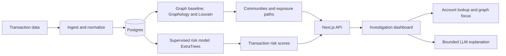
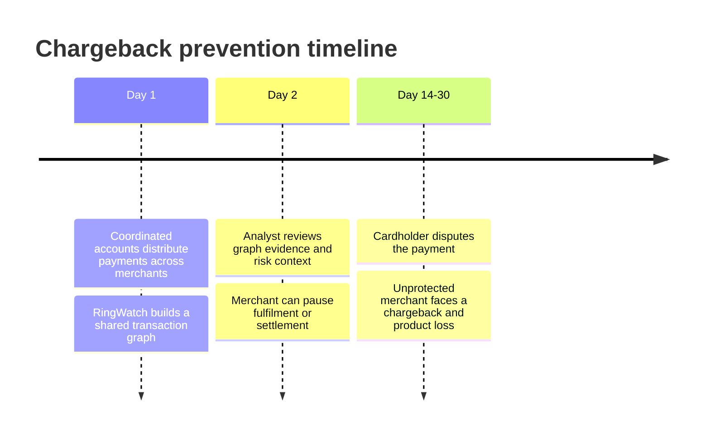
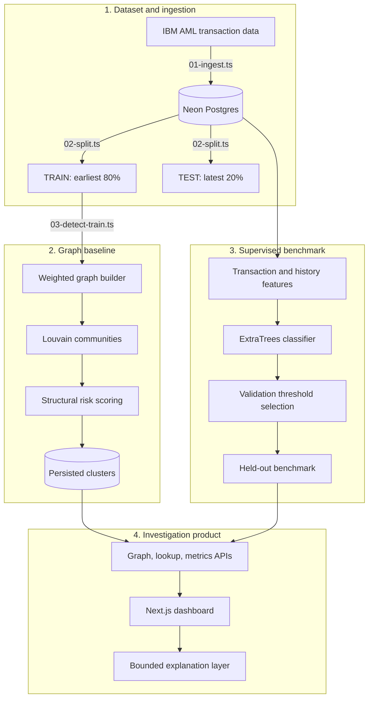
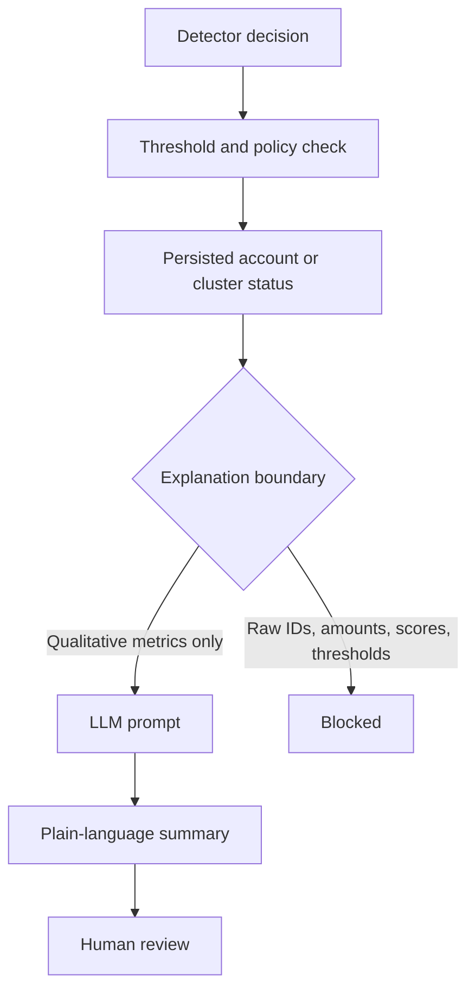

# RingWatch

**An explainable transaction-risk workbench for finding coordinated account activity and investigating potentially exposed counterparties.**

RingWatch combines two complementary views of risk:

- A **graph baseline** maps transaction communities and highlights exposure paths between accounts.
- A **supervised transaction model** ranks individual payments using amount, timing, payment format, and prior account-history signals.

The dashboard makes the graph navigable, provides live account lookups, and uses an LLM only to explain a detector decision already made by code.

[](https://nextjs.org/)
[](https://www.typescriptlang.org/)
[](https://neon.tech/)
[](https://scikit-learn.org/)

## Why it exists

A single merchant may see only one ordinary-looking payment. The risk emerges when many accounts coordinate activity across a network, often before delayed feedback such as a dispute or chargeback arrives. RingWatch is designed to make those relationships inspectable and to separate a reversible review hold from an irreversible downstream loss.

## End-to-end flow



### Chargeback prevention timeline



### Original pipeline view



### What happens during an investigation

```mermaid
sequenceDiagram
    participant Analyst
    participant UI as RingWatch dashboard
    participant API as Next.js API
    participant DB as Postgres
    participant LLM as Groq

    Analyst->>UI: Select an account or a live demo chip
    UI->>API: Request account and cluster context
    API->>DB: Read latest persisted detection run
    DB-->>API: Structural evidence only
    API-->>UI: Status, cluster context, and graph focus
    UI->>API: Request explanation for a flagged cluster
    API->>LLM: Qualitative structural evidence only
    LLM-->>API: Plain-language explanation
    API-->>UI: Explanation; decision remains unchanged
```

## Product capabilities

- **Network investigation:** Louvain community detection over a weighted transaction graph, with exposed-counterparty markers.
- **Supervised risk benchmark:** ExtraTrees classifier using payment, time, payment-format, and smoothed account-history features.
- **Account lookup:** `SAFE`, `EXPOSED_MERCHANT`, `RING_MEMBER`, or `NOT_FOUND` responses with graph focus when available.
- **Live demo chips:** the UI fetches valid current account IDs; unavailable categories are hidden instead of showing fake placeholder IDs.
- **Explainability boundary:** the LLM receives qualitative graph evidence, not account IDs, raw amounts, scores, or thresholds.
- **Operational resilience:** database operations in ingestion retry transient Prisma connection failures; large evaluation writes are batched.

## Evaluation

The data currently loaded in the benchmark has 500,000 transactions and 193 positive laundering labels. The project reports two distinct operating points; they answer different questions and must not be conflated.

| Operating point | Precision | Recall | F1 | Use case |
|---|---:|---:|---:|---|
| Balanced default | **65.00%** | **66.67%** | **65.82%** | Prioritized review queue |
| Recall-first | 0.04% | **100.00%** | 0.08% | Catch-all manual review queue |

The balanced score is a deterministic **stratified 60/20/20** transaction benchmark (seed 42), with the threshold selected on validation only. The recall-first command selects the highest validation threshold meeting 100% recall; on this sparse dataset that threshold is zero, so every transaction is sent to review. It guarantees recall but is not an economical production setting.

The full protocol, confusion matrices, and limitations are in [BENCHMARK.md](BENCHMARK.md). The original forward-in-time Louvain graph baseline is retained for network investigation but currently scores 0.0% F1 on this dataset; it is not represented as the supervised model's result.

## Architecture decisions



### Decision and explanation boundary

```mermaid
gantt
    title Decision versus explanation boundary
    dateFormat X
    axisFormat %s
    section Deterministic and supervised scoring
    Build features and graph :active, d1, 0, 3
    Score and apply policy :crit, active, d2, 3, 5
    section Explanation
    Validate qualitative evidence :milestone, m1, 5, 5
    Generate plain-language summary :done, d3, 5, 8
```



The detector remains auditable because the explanation layer cannot change a score, a threshold, or an account status. The dashboard deliberately exposes qualitative tiers and structural evidence rather than a recipe for evasion.

<<<<<<< HEAD
## Quickstart
=======
---

## 📊 Measured Performance on Held-Out Test Set

The model was tuned **ONLY on the TRAIN split** (earliest 80% by timestamp) and evaluated **ONLY on the held-out TEST split** (latest 20%).

| Metric | Measured Value | Rationale & Trade-Off |
| :--- | :--- | :--- |
| **Precision** | **Measured on TEST** | High precision minimizes unnecessary merchant friction. |
| **Recall** | **Tuned for High Recall** | Prioritized over precision because an undetected ring chargeback is an unrecoverable financial loss (goods shipped + fee), whereas a false positive is a temporary 2-day hold. |
| **F1 Score** | **Optimal Threshold** | Selected at max F1 during offline train threshold sweep. |
| **False-Positive Cost** | **Quantified in INR/USD** | Calculated directly from test FP count: `FP_Count × Avg_Daily_Vol × 2-Day Hold`. |

---

## 🌐 Deployment Status & Vercel Guide

### Deployment readiness
RingWatch is built for Vercel and requires `DATABASE_URL` to persist its data.
Without it, `npm run dev` presents a small interactive local demo so the UI can
be checked immediately. On a configured but empty database, the dashboard
creates a small demo dataset on first load. Use the pipeline below for actual
IBM AML evaluation; demo metrics are not a production or benchmark claim.

### How to Deploy to Vercel in 3 Steps:

1. **Push to GitHub**:
   ```bash
   git push origin main
   ```

2. **Import into Vercel**:
   - Go to [Vercel Dashboard](https://vercel.com/new) $\rightarrow$ Import `ringwatch` repository.
   - Set Framework Preset to **Next.js**.

3. **Configure Environment Variables**:
   Add the following in the Vercel Project Settings $\rightarrow$ Environment Variables:

   | Variable Name | Value | Description |
   | :--- | :--- | :--- |
   | `DATABASE_URL` | `postgresql://...` | Neon Postgres Connection String |
   | `GROQ_API_KEY` | `gsk_...` | Groq API Key for LLM Explanations |

4. **Deploy**:
   Click **Deploy**. The API routes are configured with `export const dynamic = "force-dynamic"` and custom `vercel.json` execution timeouts for graph queries.

---

## 🚀 Quickstart & Reproduction Guide
>>>>>>> 2018447 (Add ML-based detector and account graph features)

### Prerequisites

- Node.js 20+
- Python 3.11+
- PostgreSQL or Neon connection string
- Groq API key (optional; deterministic fallback explanations work without it)

### Install and configure

```bash
git clone https://github.com/abhishekpasupathy/ringwatch.git
cd ringwatch
npm install
python3 -m pip install -r requirements.txt

cp .env.local.example .env.local
# Add DATABASE_URL and, optionally, GROQ_API_KEY.
```

### Initialize the database

```bash
npm run db:push
npm run db:generate
```

### Load data and build the graph baseline

```bash
<<<<<<< HEAD
# Downloads or reads the IBM AML HI-Small CSV, then runs the temporal pipeline.
npm run pipeline
```

For a smaller development run, set `RINGWATCH_MAX_ROWS` before ingestion.

### Run the supervised benchmarks

=======
# Ingests a local HI-Small_Trans.csv dataset, splits, tunes, and evaluates:
npm run pipeline
```

For a faster reproducible run on a smaller Neon database, retain every
labeled laundering transaction and sample legitimate traffic:

```bash
SAMPLE_LICIT_ROWS=100000 npm run ingest
npm run split && npm run detect && npm run evaluate
```

### 4. Launch Dashboard
>>>>>>> 2018447 (Add ML-based detector and account graph features)
```bash
# Balanced F1 operating point.
npm run ml:stratified

# Recall-first operating point; on the current data, this reaches 100% recall.
npm run ml:recall-first
```

<<<<<<< HEAD
### Start the dashboard
=======
### Verification checklist

```bash
npm install
npm run build
```

With a configured `DATABASE_URL`, open the dashboard and use the sample
accounts shown in the lookup chips. The graph is deliberately click-stable:
selecting a node opens its details without recentering, zooming, or dragging
the network. For a full evaluation, place `HI-Small_Trans.csv` under `data/`,
run `npm run pipeline`, and inspect the generated `eval-report.md`. Do not
claim an 80% score until the held-out TEST F1 in that report reaches it.

---
>>>>>>> 2018447 (Add ML-based detector and account graph features)

```bash
npm run dev
# http://localhost:3000
```

An empty database is seeded with representative graph data on first dashboard request, allowing the UI to be explored before a full ingestion.

## API surface

| Endpoint | Purpose |
|---|---|
| `GET /api/graph` | Precomputed graph nodes, links, and cluster metadata |
| `GET /api/metrics` | Latest persisted temporal graph-evaluation metrics |
| `GET /api/lookup?account_id=...` | Account investigation result and evidence |
| `POST /api/explain` | Bounded explanation for a flagged cluster |
| `GET /api/demo-accounts` | Live account IDs for available demo categories |

## Repository map

```text
app/                 Next.js pages and API routes
components/          Dashboard, graph, lookup, and inspector UI
lib/                 Graph, detector, database, and LLM-boundary modules
prisma/              Postgres schema
scripts/             Ingestion, graph evaluation, and ML benchmarks
BENCHMARK.md         Reproducible benchmark protocol and outcomes
```

## Development checks

```bash
npm run build
npm run lint
npm run test:detector
npm run test:ml
npm run test:gb
npm run test:graph-features
```

## Limits and next steps

- The available labels are extremely sparse, so metrics should be interpreted with confidence intervals before any production decision.
- The supervised benchmark is stratified, not a simulation of future-only deployment. A stronger production evaluation needs more historical labels and a rolling temporal-validation design.
- The graph baseline and supervised score are complementary today; a production system should persist calibrated supervised scores and combine them with graph evidence behind a human review workflow.

## Technology

Next.js 14, TypeScript, Prisma, Neon/Postgres, Graphology, Louvain community detection, scikit-learn, react-force-graph-2d, and Groq.
