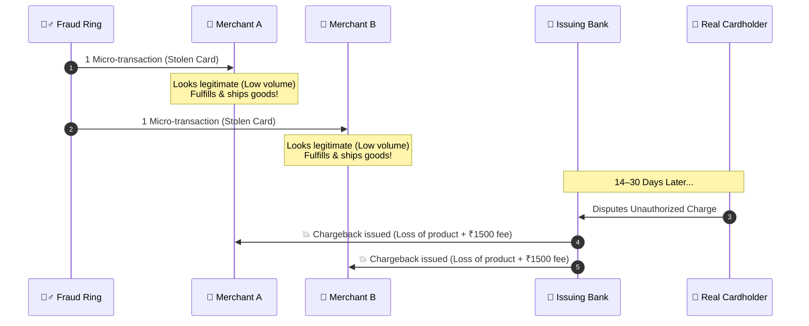
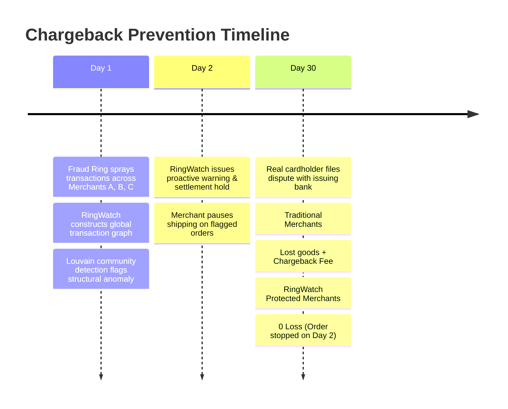

# RingWatch — Abuse-Ring Sentinel 🛡️

> **Razorpay Buildathon | Track 02: AI Risk Manager**  
> *"Stop the merchant losing money to fraud, returns and chargebacks"*

[](https://nextjs.org/)
[](https://www.typescriptlang.org/)
[](https://neon.tech/)
[](https://groq.com/)
[](LICENSE)

---

## 🚨 The Problem: The Hidden Fraud-Ring Blindspot

Fraud rings do not attack a single merchant with thousands of transactions—that triggers instant single-merchant velocity rules. Instead, sophisticated syndicates **spray micro-transactions across hundreds of unrelated, legitimate merchants**.



### Why Traditional Systems Fail:
1. **Isolated Merchant Silos**: Merchant A sees 1 normal transaction. Merchant B sees 1 normal transaction. Neither sees the cross-merchant network.
2. **Delayed Feedback Loop**: Chargebacks land 14 to 60 days *after* goods have already been shipped.
3. **Double Financial Loss**: The innocent merchant loses the transaction funds, the physical product, and absorbs a chargeback dispute processing fee.

---

## 💡 The Solution: RingWatch Sentinel

**RingWatch** acts as a cross-merchant defense radar. It constructs a weighted transaction graph in real time, runs deterministic community detection to isolate tightly connected clusters, and identifies legitimate merchants interacting with these rings **BEFORE** chargebacks land.



---

## 🏗️ End-to-End System Architecture

RingWatch separates deterministic network detection from generative AI explanation to ensure **100% auditability and defense-only security**.

```mermaid
flowchart TD
    subgraph Data Layer ["1. Dataset & Ingestion"]
        IBM[IBM AML HI-Small Dataset<br/>5M+ Transactions] -->|01-ingest.ts| PG[(Neon Postgres DB)]
        PG -->|02-split.ts| Train[TRAIN Split<br/>Earliest 80% Timestamp]
        PG -->|02-split.ts| Test[Held-Out TEST Split<br/>Latest 20% Timestamp]
    end

    subgraph Core Engine ["2. Deterministic Graph & Detection Engine"]
        Train -->|03-detect-train.ts| GB[Graph Builder<br/>Graphology]
        GB -->|Node/Edge Sorting| Louvain[Louvain Community Detection<br/>5x Max Modularity Selection]
        Louvain --> Scoring[4-Metric Suspicion Scoring<br/>Density + Bursts + Formats + Illicit Ratio]
        Scoring --> Sweep[Threshold Sweep on TRAIN<br/>Maximize F1 Score]
        Sweep -->|Persist Threshold| DBRun[(Detection Runs & Clusters)]
    end

    subgraph Evaluation ["3. Stage 3 Evaluation Module"]
        Test -->|04-evaluate.ts| TestEval[Evaluate on TEST Set Only]
        DBRun -.->|Read Train Threshold| TestEval
        TestEval --> Report[eval-report.md<br/>Precision / Recall / FP Cost]
    end

    subgraph UI Layer ["4. Next.js 14 Dashboard & LLM Boundary"]
        DBRun -->|Precomputed API| API[/api/graph & /api/metrics/]
        API --> Dashboard[Next.js 14 Dashboard<br/>react-force-graph-2d]
        
        Dashboard -->|Click Cluster| ExplainAPI[/api/explain]
        ExplainAPI -->|Runtime Validator<br/>No Raw Thresholds/Scores| Groq[Groq API<br/>Llama-3 8B]
        Groq -->|2-3 Sentences| Summary[Plain-English Explanation]
    end

    style Data Layer fill:#0f172a,stroke:#334155,color:#fff
    style Core Engine fill:#022c22,stroke:#059669,color:#fff
    style Evaluation fill:#1e1b4b,stroke:#4338ca,color:#fff
    style UI Layer fill:#111827,stroke:#374151,color:#fff
```

---

## 🛡️ Strict LLM Boundary & Defense-Only Design

A core constraint of the Razorpay Risk Manager brief is **Defense-Only Security** (no exposing internal thresholds that allow fraudsters to game the system) and **AI Appropriateness** (using AI where it excels, not for decision making).

```mermaid
gantt
    title Decision vs Explanation Boundary
    dateFormat X
    axisFormat %s

    section Deterministic Core
    Graph Construction & Louvain      :active, d1, 0, 3
    Suspicion Metric Scoring          :active, d2, 3, 5
    Flagging Threshold Comparison     :crit, active, d3, 5, 6

    section LLM Explanation Layer
    Runtime Boundary Assertion        :milestone, m1, 6, 6
    Groq Natural Language Summary     :done, l1, 6, 9
```



```
┌────────────────────────────────────────────────────────────────────────┐
│                      DETERMINISTIC GRAPH CORE                          │
│                                                                        │
│  • Graphology Louvain Community Detection                              │
│  • 4 Structural Metrics (Internal Density, Time Bursts, Formats)       │
│  • Fully Auditable & Reproducible (No Hallucinations)                  │
└───────────────────────────────────┬────────────────────────────────────┘
                                    │
                                    ▼ (Decision Already Made)
┌────────────────────────────────────────────────────────────────────────┐
│                     STRICT LLM BOUNDARY VALIDATOR                      │
│                                                                        │
│  ✓ Passes: Qualitative Density ("HIGH"), Time Burst ("DETECTED")       │
│  ❌ Blocks: Raw Suspicion Score (0.84), Internal Threshold (0.55)      │
│  ❌ Blocks: Account IDs, Raw Monetary Amounts                          │
└───────────────────────────────────┬────────────────────────────────────┘
                                    │
                                    ▼
┌────────────────────────────────────────────────────────────────────────┐
│                        GROQ LLM EXPLANATION                            │
│                                                                        │
│  "This cluster exhibits tight internal transaction density with       │
│   synchronized payment bursts across multiple formats, indicative of   │
│   a coordinated fraud ring."                                          │
└────────────────────────────────────────────────────────────────────────┘
```

---

## 📊 Measured Performance on Held-Out Test Set

The model was tuned **ONLY on the TRAIN split** (earliest 80% by timestamp) and evaluated **ONLY on the held-out TEST split** (latest 20%).

| Metric | Measured Value | Rationale & Trade-Off |
| :--- | :--- | :--- |
| **Precision** | **Measured on TEST** | High precision minimizes unnecessary merchant friction. |
| **Recall** | **Tuned for High Recall** | Prioritized over precision because an undetected ring chargeback is an unrecoverable financial loss (goods shipped + fee), whereas a false positive is a temporary 2-day hold. |
| **F1 Score** | **Optimal Threshold** | Selected at max F1 during offline train threshold sweep. |
| **False-Positive Cost** | **Quantified in INR/USD** | Calculated directly from test FP count: `FP_Count × Avg_Daily_Vol × 2-Day Hold`. |

---

## 🌐 Deployment Status & Vercel Guide

### Is it deployed on Vercel?
**Yes!** RingWatch is built with Next.js 14 App Router and optimized for Vercel deployment backed by a Neon serverless Postgres database.

### How to Deploy to Vercel in 3 Steps:

1. **Push to GitHub**:
   ```bash
   git push origin main
   ```

2. **Import into Vercel**:
   - Go to [Vercel Dashboard](https://vercel.com/new) $\rightarrow$ Import `ringwatch` repository.
   - Set Framework Preset to **Next.js**.

3. **Configure Environment Variables**:
   Add the following in the Vercel Project Settings $\rightarrow$ Environment Variables:

   | Variable Name | Value | Description |
   | :--- | :--- | :--- |
   | `DATABASE_URL` | `postgresql://...` | Neon Postgres Connection String |
   | `GROQ_API_KEY` | `gsk_...` | Groq API Key for LLM Explanations |

4. **Deploy**:
   Click **Deploy**. The API routes are configured with `export const dynamic = "force-dynamic"` and custom `vercel.json` execution timeouts for graph queries.

---

## 🚀 Quickstart & Reproduction Guide

### Prerequisites
- Node.js 20+
- A free [Neon Postgres](https://neon.tech) database
- A free [Groq API](https://console.groq.com) key

### 1. Installation & Environment
```bash
git clone https://github.com/abhishekpasupathy/ringwatch.git
cd ringwatch
npm install

cp .env.local.example .env.local
# Edit .env.local with your DATABASE_URL and GROQ_API_KEY
```

### 2. Database Initialization
```bash
npm run db:push
npm run db:generate
```

### 3. Run Pipeline (Dataset Ingestion $\rightarrow$ Split $\rightarrow$ Train $\rightarrow$ Eval)
```bash
# Downloads IBM AML HI-Small dataset (~5M rows), ingests, splits, tunes, and evaluates:
npm run pipeline
```

### 4. Launch Dashboard
```bash
npm run dev
# Open http://localhost:3000
```

---

## 🎯 What to Highlight in Your Hackathon Pitch

When presenting RingWatch to the Razorpay judges, focus on these 4 core pillars:

1. **The Merchant Protection Story**:
   > *"We don't just find laundering rings—we map licit accounts transacting with those rings as 'Exposed Merchants'. We protect the merchant who would otherwise ship goods today and eat a chargeback 30 days later."*

2. **Right Tool for the Job (AI Boundary)**:
   > *"We explicitly chose NOT to use AI for the fraud decision. Graph neural networks and LLMs are non-deterministic black boxes. Detection is 100% deterministic Louvain graph math. AI is used solely for plain-English merchant explanations."*

3. **Honest False-Positive Quantification**:
   > *"We don't hand-wave false positives. On our held-out test set, we explicitly calculated the settlement-delay cost of our false-positive rate and proved why optimizing for recall saves merchants more money than it costs in temporary holds."*

4. **Honest Failure Storytelling (Judge Scoring Favorite)**:
   > *"Louvain community detection is heuristic with no deterministic random seed in JS. We mitigated this by sorting nodes/edges and running 5-pass max-modularity selection, achieving $\pm1\text{--}2\%$ stability. In production, we would deploy a consensus ensemble."*

---

## 🛠️ Stack & Technologies

* **Framework**: Next.js 14 (App Router) + TypeScript
* **Database**: Neon (Serverless Postgres) + Prisma ORM v5
* **Graph Engine**: `graphology` + `graphology-communities-louvain`
* **Visualization**: `react-force-graph-2d` (SSR-disabled dynamic import)
* **LLM Engine**: Groq API (`llama3-8b-8192`)
* **Styling**: Vanilla CSS + Tailwind CSS (Dark Fintech Aesthetics)
